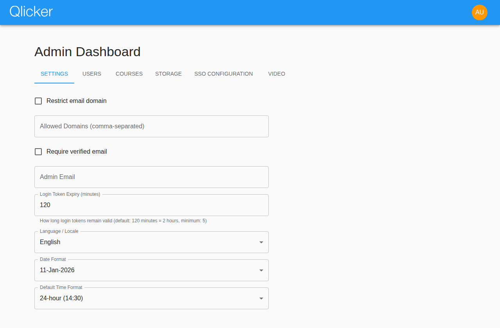
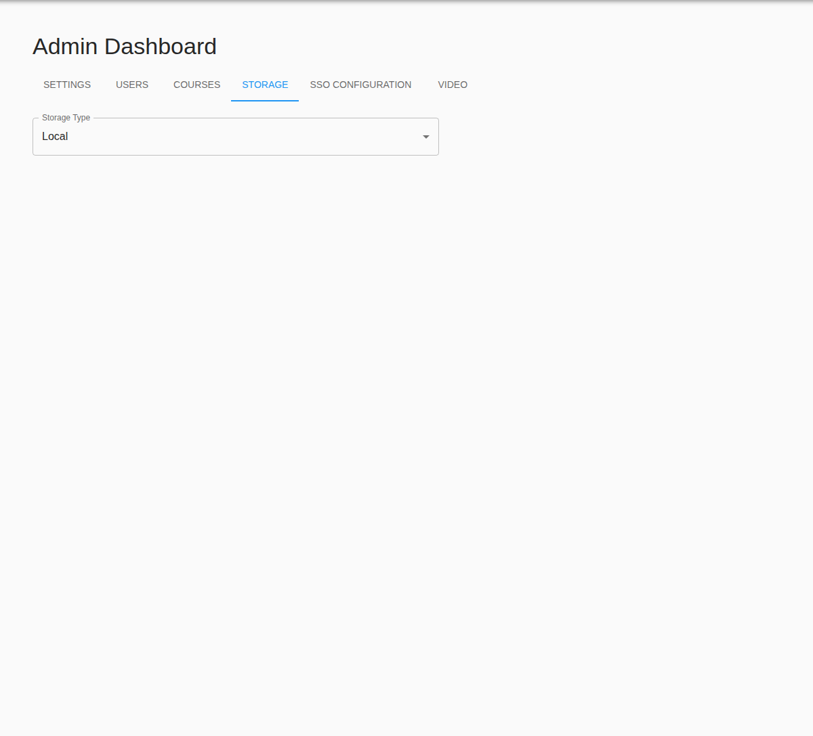

# Admin User Manual

Use this guide when configuring institution-wide settings, storage, SSO, user roles, and course-level support in the current Qlicker app.

## At a glance

- **Best starting page:** admin dashboard
- **Highest-risk workflows:** storage credentials, SSO certificates, and global login settings
- **Best support habit:** compare the problem against the professor or student manual before answering a user
- **Related guides:** [Professor manual](professor.md), [Student manual](student.md), [Production deployment guide](../../production_setup/README.md)

## Table of contents

1. [Admin dashboard](#admin-dashboard)
2. [General settings](#general-settings)
3. [User and course support](#user-and-course-support)
4. [Storage configuration](#storage-configuration)
5. [SSO configuration](#sso-configuration)
6. [Video configuration](#video-configuration)
7. [Troubleshooting checklist](#troubleshooting-checklist)

## Quick start checklist

1. Confirm the deployment environment and public URLs before changing app settings.
2. Review general settings, storage, SSO, and video before large onboarding periods.
3. Use the Users and Courses tabs for day-to-day support and verification.
4. Retest any global auth or storage change before announcing it to users.

## Admin dashboard

The admin dashboard centralizes institution-wide configuration.

The current app exposes these major tabs:

- **Settings** for general platform defaults
- **Users** for role and account management
- **Courses** for broad course lookup and support
- **Storage** for image backends
- **SSO Configuration** for SAML settings
- **Video** for Jitsi configuration and availability

Because the dashboard autosaves after short pauses, review each field carefully before leaving a tab.

## General settings

Use the Settings tab to control defaults that affect every user.

Common settings include:

- allowed email domains
- whether verified email is required
- the administrative support email
- login token lifetime
- default locale
- default date format
- default time format

### Best practices

| Setting | Recommendation |
| --- | --- |
| Allowed domains | Keep the list explicit and comma-separated |
| Verified email | Decide this before onboarding large numbers of users |
| Support/admin email | Use a monitored mailbox so error messages reach a real team |
| Locale/date/time defaults | Pick institution-wide defaults, then let users override them when appropriate |

## User and course support

### Users tab

The Users tab is your main support surface for accounts.

From there you can:

- search users by name or email
- create accounts directly
- change roles
- verify email status
- inspect or update per-user properties
- control whether local email login is allowed for SSO-created accounts

Use extra care when changing roles because the effect is immediate.

### Courses tab

The Courses tab helps admins support instructors without signing in as them.

Use it to:

- locate courses by code, title, or term
- verify who owns or teaches a course
- confirm whether a course appears active and ready for students
- reproduce support questions against the current course configuration

## Storage configuration

Qlicker supports multiple image-storage backends, managed from the Storage tab.

Supported modes include:

- local storage
- Amazon S3 or S3-compatible storage
- Azure Blob storage

### Storage workflow

1. Choose the provider.
2. Fill only the fields required by that provider.
3. Save the settings.
4. Upload a test image from the app to confirm read and write behavior.

### Provider-specific notes

| Provider | Required fields to verify |
| --- | --- |
| Local | uploaded files survive restarts and deployments |
| Amazon S3 / compatible | bucket, region, access key, secret key, optional endpoint/path-style support |
| Azure Blob | storage account, access key, container name |

Treat access keys, secret keys, and similar credentials as secrets.

## SSO configuration

The SSO Configuration tab manages SAML settings for institutional login.

Prepare the following before enabling SSO:

- IdP entry point URL
- logout URL
- entity ID / issuer values
- email, first-name, last-name, role, and student-number attribute mappings
- the IdP certificate
- the SP certificate and private key if your deployment requires them

### After any SSO change, always retest

- sign-in
- callback handling
- logout
- professor and student role mapping

If SSO is wrong, it can prevent access for many users at once, so make changes during a maintenance window when possible.

## Video configuration

Qlicker can integrate Jitsi-based video workflows.

The Video tab is where you:

- enable or disable video globally
- define the Jitsi domain
- configure related Etherpad settings if used
- verify which courses should expose video options

After configuration, test with a real course before announcing the feature.

## Troubleshooting checklist

### Users cannot sign in

Check:

- whether SSO is enabled unexpectedly
- whether SSO metadata and certificates are current
- whether local email login is allowed for the affected account
- whether the public deployment URLs match the running environment

### Uploaded images fail

Check:

- the selected storage provider
- the provider credentials
- bucket or container existence and permissions
- whether a recent configuration change was saved incompletely
- whether a fresh test upload reproduces the problem

### Professors cannot access expected course features

Check:

- their role
- course instructor membership
- course settings such as video availability or student-submission permissions
- whether the feature depends on a global admin setting

## Related manuals

- [Professor user manual](professor.md)
- [Student user manual](student.md)
- [Production deployment guide](../../production_setup/README.md)
