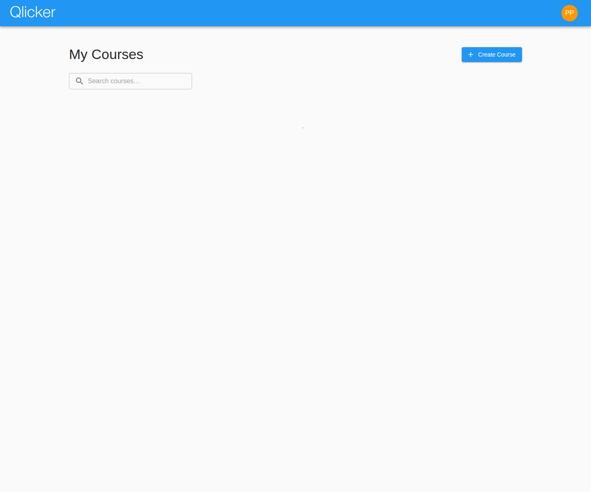
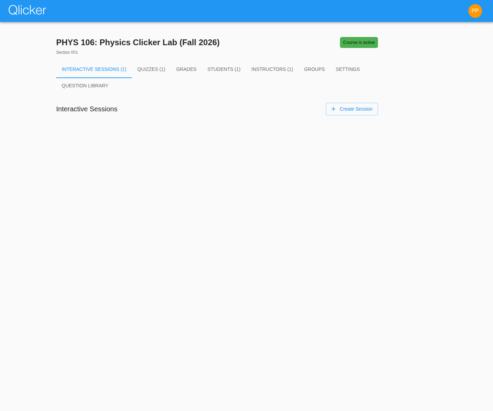
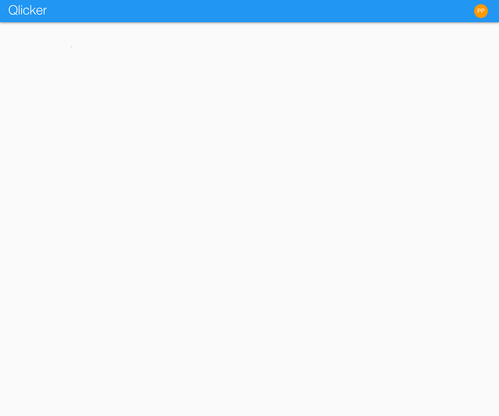

# Professor User Manual

Use this guide to create courses, manage enrollment, build question flows, run sessions and quizzes, review results, and grade student work in the current Qlicker app.

## Quick start

1. Create the course with a clear, reusable semester label.
2. Add course topics before writing or importing many questions.
3. Create sessions from the course page, then decide whether each one is an interactive session, a quiz, or student practice support.
4. Review results after the activity and recalculate grades if scoring rules or manual marks changed.

## Professor dashboard

The professor dashboard lists the courses you can manage.

From the dashboard you can:

- open an existing course
- create a new course
- search courses by title, code, section, or semester
- see the current course status at a glance

## Creating and organizing a course

After creating a course, most ongoing work happens from the course page.

The course page combines:

- interactive session lists
- quiz lists
- grade access
- student and instructor management
- groups
- video settings when enabled
- course settings
- the course question library

Recommended setup order:

1. Confirm the course title, code, section, and semester.
2. Add course topics so question tagging stays consistent.
3. Share or rotate the enrollment code as needed.
4. Add instructors or TAs before the term begins.
5. Review whether students are allowed to submit questions.

## Enrollment, students, and instructors

### Adding students

Students usually enroll themselves with the course code, but you can still manage enrollment from the course page.

Use the Students tab to:

- review the class list
- search students by name or email
- remove a student from the course
- inspect student details when troubleshooting access or grading questions

### Adding instructors or TAs

Use the Instructors tab to add other teaching staff to the course.

Teaching staff can help with course workflows, but course ownership and institution-level admin settings still matter for permission-sensitive changes.

## Groups

Groups are course-specific and are best prepared before class.

Use the Groups tab to:

- create a category of groups
- choose how many groups the category contains
- rename groups for more meaningful labels
- move students between groups
- import or export group assignments as CSV

Groups are especially useful when:

- different TAs are grading different subsets of students
- you want breakout or discussion organization before a class session
- you need a repeatable grouping for later grading and analysis workflows

## Building sessions

Sessions in the current app are ordered teaching flows. They can include both questions and slides.

From the session editor you can:

- set the session name and description
- choose whether the session is interactive, quiz-based, or reviewable later
- require a join passcode
- set quiz start and end dates
- add quiz extensions
- choose the multiple-select scoring method
- insert slides anywhere in the session order
- add questions from the library or create them inline
- export and import session JSON
- open print or PDF export views

### Question types supported in the current app

Qlicker supports:

- multiple choice
- true / false
- multi-select
- short answer
- numerical
- slides (content-only items inside sessions)

### Tips for building strong sessions

- Use slides before or between questions when students need instructions or context.
- Keep topic tags consistent with course topics so search and reuse stay clean.
- Review visibility rules carefully before copying or sharing questions.
- For quizzes, confirm the dates and the reviewability setting before publishing.

## Using the question library

The question library is useful both during preparation and while editing a session.

Use it to:

- search by keyword, type, tags, or visibility
- copy questions into a session
- bulk update visibility for selected questions
- import or export JSON bundles
- review student-submitted material when that workflow is enabled

In the current app, visibility is especially important because some questions may be private, course-visible, or broadly reusable across Qlicker.

## Running live sessions

Interactive sessions are designed for instructor-paced teaching.

A typical live-session workflow is:

1. Launch the session from the course page.
2. Confirm whether join codes or passcodes are required.
3. Move between questions with the navigation controls.
4. Open or close responses for each attempt.
5. Reveal statistics or correct answers when ready.
6. Start a new attempt if you want students to answer again.
7. End the session when the activity is complete.

Live-session controls in the current app also support presentation workflows such as the presenter view and the second-display window.

## Running quizzes

Use quizzes when students should work through a scheduled assessment rather than follow the exact pace of a live class.

Quizzes support:

- start and end times
- per-user extensions
- reviewability after submission
- later grade recalculation if scoring rules change

Before opening a quiz to students, confirm:

- the quiz start time
- the quiz end time
- whether the quiz should be reviewable afterward
- whether the question order and session content are final

## Reviewing responses and results

After a session or quiz is complete, open the review page to inspect outcomes.

The review workflow helps you:

- inspect response counts and distributions
- review per-question outcomes
- move into grading workflows
- confirm that student participation matches expectations

For live teaching, review data is often the quickest way to see where the class struggled.

## Grading

Qlicker supports both automatic grading and manual grading.

Use the grading workflows to:

- recalculate grades for one session or many sessions
- inspect each student's marks
- resolve manual-vs-automatic grading conflicts
- edit feedback and point values
- export course grades to CSV

Short-answer questions typically require manual attention, while many objective question types can be autograded.

See also the dedicated [grading guide](grading.md).

## Copying and reusing work

The current app makes reuse practical in several ways:

- copy questions into new sessions
- copy sessions to other courses you teach
- export sessions as JSON for re-import
- export printable or PDF-friendly session views

Whenever you reuse material, verify that:

- quiz dates are still valid
- session-specific visibility and review settings make sense in the destination course
- copied tags still match the destination course topics

## Troubleshooting

### Students cannot join the course

Check:

- the current enrollment code
- whether verified email or SSO is required
- whether the student is already enrolled under another account

### Students can open the session but cannot answer

Check:

- whether responses are currently allowed
- whether the active item is a slide rather than a question
- whether the join or passcode settings changed
- whether the session is still running

### Grades do not look correct

Check:

- the session's scoring settings
- whether manual marks intentionally override autograding
- whether the session needs recalculation after question edits or late grading work
- whether low-response rules or multiple-select scoring behavior explain the result

## Related manuals

- [Student user manual](student.md)
- [Admin user manual](admin.md)
- [Grading guide](grading.md)
