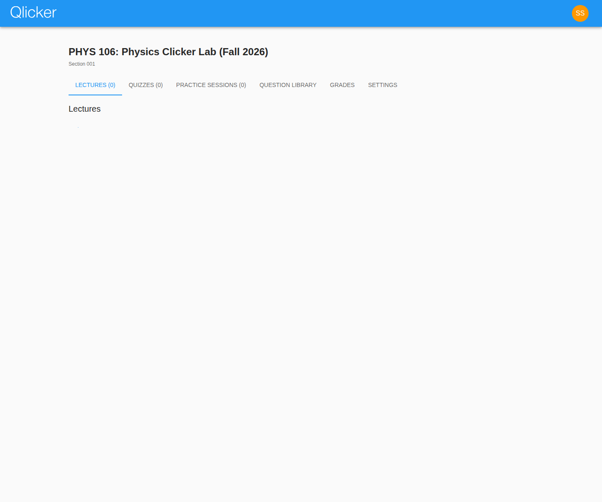
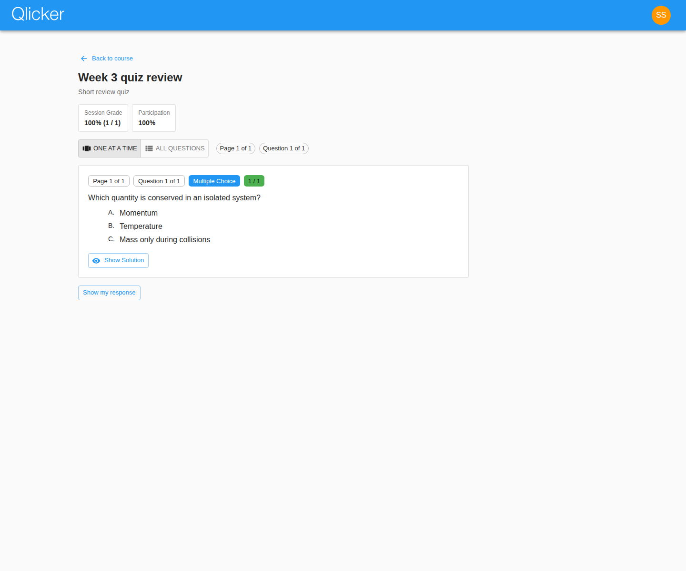

# Student User Manual

Use this guide to enroll in courses, join live sessions, complete quizzes, review feedback, and build practice sessions in the current Qlicker app.

## Quick start

1. Log in with your Qlicker account or your institution's SSO if your deployment has SSO enabled.
2. Enter the course enrollment code supplied by your instructor.
3. Open the course page and choose the correct tab: live sessions, quizzes, practice sessions, grades, or question library.
4. After class, return to reviewable sessions and your practice sessions to study with feedback.

## Dashboard and enrollment

The student dashboard is your starting point for every course.

- Each enrolled course appears as a card on the dashboard.
- Enrollment is done from the dashboard using the course code supplied by your instructor.
- Once a course is added, it stays on your dashboard until you are removed from it or it is archived for your account.
- If your institution requires verified email or SSO, finish that requirement before assuming the course code is incorrect.

## Course page layout

The course page separates each type of work into tabs so that live class work, quizzes, review, practice, and grades do not get mixed together.

On the course page you will typically see:

- **Lectures / live sessions** for instructor-led interactive sessions
- **Quizzes** for timed assessments
- **Practice sessions** for self-study and rehearsal
- **Question library** for visible study questions and question-based practice workflows
- **Grades** for your course-level grade table and session grades
- **Video chat** when your course has Jitsi enabled

## Joining live sessions

Live sessions are used when an instructor is controlling the pace of the class.

1. Open the course page.
2. Select the live session card when it becomes available.
3. Enter the join code or passcode if the instructor requires one.
4. Wait for the current question or slide to appear.
5. Submit your answer once the instructor allows responses.

Important live-session behavior:

- Instructors can hide the question temporarily.
- Instructors can stop responses and reopen them for another attempt.
- Some sessions include slides between questions. Slides are content-only pages, so read them before moving on.
- If statistics or correct answers are visible, that happens only when the instructor turns them on.

## Taking quizzes

Quizzes are different from live sessions because they are scheduled windows rather than instructor-paced question changes.

- A quiz is available only during its configured time window unless you have an extension.
- Your responses save while you move through the quiz.
- Some deployments display one question at a time while others let you move around more freely depending on the workflow and question type.
- Once submitted, a normal quiz cannot be edited again.

If you use an accommodation or extension, confirm the start and end time displayed in the quiz page before you begin.

## Reviewing finished work

When an instructor marks a session or quiz as reviewable, you can return to study your answers and feedback.

Review pages are useful because they can show:

- your submitted answer
- the released correct answer
- the instructor's explanation or solution
- feedback on manually graded questions
- points and participation information

## Practice sessions

Practice sessions are student-paced study sessions.

Use practice sessions when you want to:

- rehearse visible library questions on your own schedule
- create a short study set before a quiz or exam
- immediately review your results and try again

A good workflow is:

1. Search the question library for questions on the topic you want to revisit.
2. Add selected questions to a new practice session.
3. Complete the practice session.
4. Review the results immediately and repeat with another set if needed.

## Question library for students

Student access to the library depends on what instructors make visible.

In the current app, the student library may include:

- questions shared with students in the course
- course-visible questions approved by instructors
- student-created material in practice workflows when allowed

Use the library to find practice material, not as a substitute for the course tabs. Live sessions and quizzes still start from the course page.

## Grades and feedback

The Grades tab shows only your own grades.

Keep in mind:

- A session must usually be reviewable before detailed results appear.
- Non-reviewable sessions may stay hidden from your student grade view.
- Feedback can arrive after the original activity if the instructor manually grades short-answer work later.

See also the shared [grading guide](grading.md).

## Profile and account settings

From the account menu you can:

- open your profile
- change supported profile fields
- update your password if your account is not managed by SSO
- change your preferred language when multiple locales are available

If your account is SSO-managed, some profile fields may be locked intentionally.

## Troubleshooting

### I cannot join a course

Check the following in order:

1. The course code was entered exactly as supplied.
2. Your account is verified if your institution requires verified email.
3. You are signing in through the correct route: email/password or SSO.
4. The instructor has not rotated the enrollment code since you received it.

### I cannot answer a live question

Possible reasons:

- the instructor has not opened responses yet
- responses have been disabled for the current attempt
- the instructor has moved to a slide or a different question
- the question has already been submitted and the workflow does not allow another attempt

### I cannot see my results

Possible reasons:

- the session is not reviewable yet
- manual grading is still in progress
- the instructor has hidden grades for that session

## Related manuals

- [Professor user manual](professor.md)
- [Admin user manual](admin.md)
- [Grading guide](grading.md)
